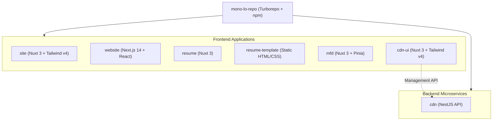

# ⚡ mono-lo-repo

[](https://turbo.build/)
[](https://www.npmjs.com/)
[](https://nuxt.com/)
[](https://nextjs.org/)
[](https://nestjs.com/)
[](https://tailwindcss.com/)
[](https://www.typescriptlang.org/)

A high-performance TypeScript monorepo orchestrated with **Turborepo** and **npm workspaces**, housing personal web applications, interactive dashboards, portfolios, and backend microservices maintained by **Stefano Monolo**.

---

## 🚀 Applications & Microservices

The repository contains the following workspace projects in the [`apps/`](./apps) directory:

| Application           | Path                                             | Framework / Tech Stack                             | Description                                           |
| :-------------------- | :----------------------------------------------- | :------------------------------------------------- | :---------------------------------------------------- |
| **`cdn`**             | [`apps/cdn`](./apps/cdn)                         | NestJS 10, RxJS, Express                           | Backend REST API & media asset CDN microservice       |
| **`cdn-ui`**          | [`apps/cdn-ui`](./apps/cdn-ui)                   | Nuxt 3, Vue 3, Tailwind CSS v4, Vue Query          | Admin dashboard UI for managing CDN files and assets  |
| **`site`**            | [`apps/site`](./apps/site)                       | Nuxt 3, Vue 3, Tailwind CSS v4, Nuxt Icons & Fonts | Personal website & digital portfolio                  |
| **`website`**         | [`apps/website`](./apps/website)                 | Next.js 14, React 18, TypeScript, Tailwind CSS v3  | Web application built with Next.js                    |
| **`resume`**          | [`apps/resume`](./apps/resume)                   | Nuxt 3, Vue 3, Tailwind CSS v3                     | Interactive CV / Online Resume                        |
| **`resume-template`** | [`apps/resume-template`](./apps/resume-template) | HTML5, CSS3                                        | ATS-optimized static single-page HTML resume template |
| **`mfd`**             | [`apps/mfd`](./apps/mfd)                         | Nuxt 3, Vue 3, Pinia, Vue Query, Tailwind CSS v3   | Multi-Function Dashboard application                  |

---

## 🛠️ Architecture Overview



---

## 💻 Getting Started

### Prerequisites

- **Node.js**: `^20.0.0` or later
- **Package Manager**: `npm@11.2.0` (enforced via `packageManager` field)

### Installation

Clone the repository and install dependencies using npm:

```bash
git clone https://github.com/smnl/mono-lo-repo.git
cd mono-lo-repo
npm install
```

---

## 📜 Available Scripts

Command scripts defined in [`package.json`](./package.json) leverage Turborepo caching and parallelization.

### Development

Run all applications in development mode simultaneously:

```bash
npm run dev
```

Or run a specific application:

| Application         | Command                       |
| :------------------ | :---------------------------- |
| **CDN API**         | `npm run dev:cdn`             |
| **CDN UI**          | `npm run dev:cdn-ui`          |
| **Site**            | `npm run dev:site`            |
| **Website**         | `npm run dev:website`         |
| **Resume**          | `npm run dev:resume`          |
| **Resume Template** | `npm run dev:resume-template` |
| **MFD**             | `npm run dev:mfd`             |

### Building for Production

Build all workspace apps:

```bash
npm run build
```

Or build a specific application:

```bash
npm run build:cdn-ui          # Build CDN UI
npm run build:site            # Build Site
npm run build:website         # Build Website
npm run build:resume          # Build Resume
npm run build:resume-template # Build Resume Template
npm run build:mfd             # Build MFD
npm run build:dev             # Build CDN API
```

### Code Formatting

Format all codebase files with Prettier:

```bash
npm run format
```

---

## 🐳 CI/CD & Containerization

- **CDN Microservice Docker Image**: Located in [`apps/cdn`](./apps/cdn).
- **Automated Workflow**: Defined in [`.github/workflows/build-push-cdn.yml`](./.github/workflows/build-push-cdn.yml).
- **GitHub Container Registry (GHCR)**: Triggers on pushes to `main` impacting `apps/cdn/**` to build and push ARM64 images to `ghcr.io/<owner>/cdn:latest`.

---

## 📂 Repository Structure

```
mono-lo-repo/
├── .github/
│   └── workflows/
│       └── build-push-cdn.yml   # GitHub Actions workflow for CDN Docker builds
├── apps/
│   ├── cdn/                     # NestJS backend API / CDN microservice
│   ├── cdn-ui/                  # Nuxt 3 admin interface for CDN
│   ├── mfd/                     # Nuxt 3 multi-function dashboard
│   ├── resume/                  # Nuxt 3 online CV / resume
│   ├── resume-template/         # ATS-optimized static HTML resume template
│   ├── site/                    # Nuxt 3 personal website & portfolio
│   └── website/                 # Next.js 14 web app
├── package.json                 # Root dependencies & Turborepo scripts
├── turbo.json                   # Turborepo task pipeline configuration
├── .prettierrc                  # Code formatting configuration
└── README.md                    # Project documentation
```

---

## 👤 Author

**Stefano Monolo**

- Email: [stefano@smnl.dev](mailto:stefano@smnl.dev)

---

## 📄 License

Private & Proprietary. All rights reserved.
